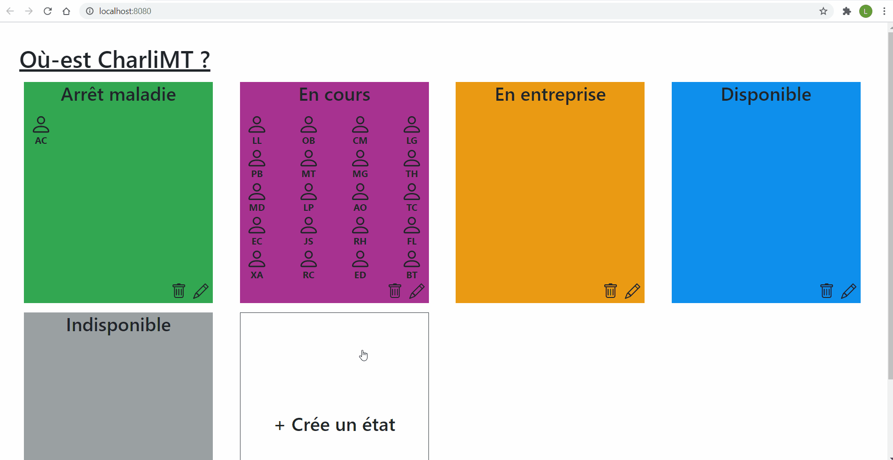

# Où-est-CharliMT

## Project setup
To use this project you will need vueJS, npm and node. Make sure it is well installed.

After that run next commands
```
$ npm install -g json-server
$ npm install
```

## Project running
Run the API
```
$ npm run api
```
Run the vue application
```
$ npm run serve
```

## Project Structure
This project use a lot of bootstrap component because I think it's one the easier and quicker way to have a complex web page.
As main Vue projects, I created component dedicated to limit copy/paste html structure and logical. It's also the best practice for Vue projects.

## Features
### DEMO / Tuto
This gif show you all features developped


### Features list
#### Modify rooms/states
A user can change title and background color rooms.
He just have to clic on the pen, update values and click on validate.
He can cancel the update too by clicking on the cross.

#### Move person from room/state
A user can drag and drop people from different rooms/states

#### Create rooms/states


----------------------------------------------------------------------------------------------
## Improvements TODO
The application can easily be improved. But because of a lack of time I will probably not do it

### Add tooltip and button on icons
To improve UX, it should be a good idea adding tooltips on icons to explain the user what it do.
Furtermore, it cool be a good idea to add button under those because user don't really know that they can/had click on icons. 
Finally, they never really have information that they had trigger actions. It could be a problem if this user don't have a good connection. For example if someone click on "Crée un état", it trigger an add of state. If he don't have a good connection the state would be done a long time after the click (so the user would be tempted to click many time on the icon)

### Add "add user" feature in UI
For now the only way to add a user is to use API/endpoint manually. A lambda user can't do that

### Change cursor during drag and drop
The cursor should change. That way a user could know if he can drag and drop or if he is on bad element


### Bugs
#### Move user by selecting room title
If you drop a user on room/state title, it doesn't work
Problem come from target drag event
I should :
 -  Move the dropzone class and the data-id to room container
 -  Explore target drag event parent to find element with the dropzone class

#### Move user by selecting user in target room
If you drop a user on a room/state user, it doesn't work
Same solution as before

#### Responsible
The application is main responsible but it could be better

## Thanks
I've found the way to drag and drop element here http://jsfiddle.net/ortzv3j7/3/
